% Steam Audio Unity Plugin 2.0-beta.13

# Steam Audio Unity Plugin <small><small>2.0-beta.13</small></small>

Copyright 2017 Valve Corporation. All rights reserved. Subject to the following license: 
[https://valvesoftware.github.io/steam-audio/license.html](https://valvesoftware.github.io/steam-audio/license.html)

## Introduction
Thanks for trying out Steam Audio. It is a complete solution for adding 3D audio and environmental effects to your game
or VR experience. It has the following capabilities:

- **3D audio for direct sound.** Steam Audio binaurally renders direct sound using HRTFs to accurately model the 
  direction of a sound source relative to the listener. Users can get an impression of the height of the source, as well 
  as whether the source is in front of or behind them.

- **Occlusion and partial occlusion**. Steam Audio can quickly model raycast occlusion of direct sound by solid objects. 
  Steam Audio also models partial occlusion for non-point sources.

- **Model a wide range of environmental effects.** Steam Audio can model many kinds of environmental audio effects, 
  including slap echoes, flutter echoes, occlusion of sound by buildings, propagation of occluded sound along alternate 
  paths, through doorways, and more.

- **Create environmental effects and reverbs tailored to your scene.** Steam Audio analyzes the size, shape, layout, and 
  material properties of rooms and objects in your scene. It uses this information to automatically calculate 
  environmental effects by simulating the physics of sound.

- **Automate the process of creating environmental effects.** With Steam Audio, you don’t have to manually place effect 
  filters throughout your scene, and you don’t have to manually tweak the filters everywhere. Steam Audio uses an 
  automated real-time or pre-computation based process where environmental audio properties are calculated (using 
  physics principles) throughout your scene.

- **Generate high-quality convolution reverb.** Steam Audio can calculate convolution reverb. This involves calculating 
  Impulse Responses (IRs) at several points throughout the scene. Convolution reverb results in compelling environments 
  that sound more realistic than with parametric reverb. This is particularly true for outdoor spaces, where parametric 
  reverbs have several limitations.

- **Head tracking support.** For VR applications, Steam Audio can use head tracking information to make the sound field 
  change smoothly and accurately as the listener turns or moves their head.

### How Steam Audio Works
This section describes the various parts of Steam Audio, focusing on the way in which the computational load is divided 
between multiple threads. Steam Audio interacts with three main threads:

1. **Game Thread**. This thread controls the game state, and sends this information to the Simulation Thread. In Unity 
   parlance, the Game Thread is the thread on which MonoBehavior.Update is executed. This thread is managed by the game 
   engine, and runs as fast as the game engine chooses to execute it, which might be 60 Hz assuming vsync is enabled.

2. **Simulation Thread.** This thread actually carries out the sound propagation simulation, and performs the bulk of 
   the computational work. It uses source and listener information provided by the Game Thread, and calculates an 
   impulse response for use by the Rendering Thread. This process involves ray tracing. This thread is managed 
   internally by Steam Audio, and runs as fast as it can, but no faster than the Rendering Thread.

3. **Rendering Thread.** This thread applies direct occlusion, 3D audio, and environmental effects to each sound source. 
   Steam Audio inserts DSP code into the main audio thread, to perform convolutions with multi-channel impulse 
   responses. This thread runs at the audio DSP rate, which is typically 512 or 1024 samples per frame, and 44100 (or 
   48000, depending on the audio driver) samples per second.

### Integration and Platforms
Steam Audio supports **Unity 5.3 or higher**. If you are using a different game engine or audio middleware, you will 
need to use the Steam Audio C API. Refer to the *Steam Audio API Reference* for further information.

The Steam Audio Unity plugin currently supports:

* Windows 7 or later (32-bit and 64-bit)
* Linux (32-bit and 64-bit, tested with Ubuntu 16.04 LTS)
* macOS 10.7 or later
* Android 4.1 or later

## Unity Integration
This chapter explains how to use Steam Audio with Unity. It assumes that you are using Unity’s built-in native audio 
engine. Support for third-party audio middleware like FMOD Studio and Audiokinetic Wwise will be available soon.

### Setting Up Your Unity Project

#### Importing Steam Audio
Before using Steam Audio in Unity, you must add it to your Unity project. To integrate Steam Audio into your Unity 
project:

1.  From the Unity menu, choose **Assets** > **Import Package** > **Custom Package**.
2.  Navigate to the directory where you downloaded Steam Audio. Within this folder, navigate to the 
    <code>bin/unity/</code> subdirectory.
3.  Double-click the <code>SteamAudio.unitypackage</code> file.
4.  In the Import dialog box that appears, make sure everything is selected, and click the **Import** button.

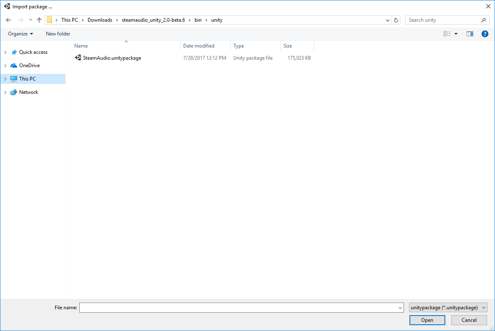

#### Unity Project Settings
Before using Steam Audio to spatialize Audio Sources in Unity, you must select Steam Audio as your spatializer plugin:

1.  Click **Edit** > **Project Settings** > **Audio**.
2.  Under **Spatializer Plugin**, choose **Steam Audio Spatializer**.

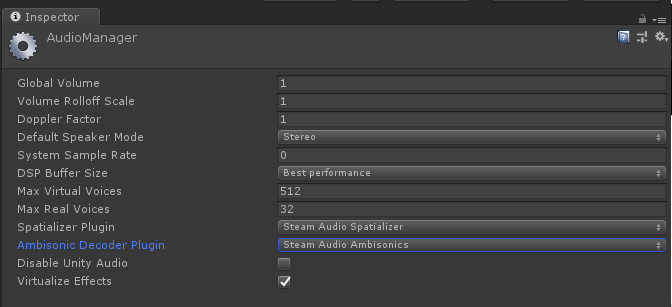

> **NOTE**  
  This step is not required if you are only using Steam Audio for listener-centric reverb.

If you're using a version of Unity older than 5.6.0, and Steam Audio Spatializer does not show up in the Spatializer
Plugin dropdown, follow these steps:

  1. In the Project tab, select:
    - `Assets/Plugins/x86_64/audioplugin_phonon.dll` (if using the 64-bit Windows editor),
    - `Assets/Plugins/x86/audioplugin_phonon.dll` (if using the 32-bit Windows editor), or
    - `Assets/Plugins/audioplugin_phonon.bundle` (if using the macOS editor).
  2. In the Inspector tab, make sure **Any Platform** is unchecked, and **Editor** and **Standalone** are checked.

#### Steam Audio Settings
For each scene where you plan to use Steam Audio, you must set up Steam Audio to work with your audio engine (in this 
case, Unity’s built-in audio engine):

1.  Click **Window** > **Steam Audio**. You may dock the Steam Audio window that appears to any part of the Unity window 
    that you prefer.
2.  Under **Audio Engine**, choose **Unity**. 

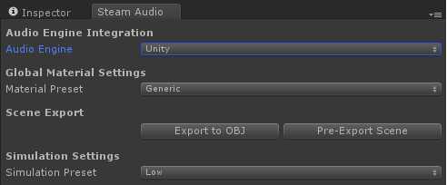

##### Steam Audio Manager
A Steam Audio Manager component must be present in your scene to use Steam Audio. A GameObject named 
**Steam Audio Manager Settings**, containing a Steam Audio Manager component, will be created automatically when you 
click **Window** > **Steam Audio**.

### Direct Sound
Steam Audio offers an easy way to model the direct (straight-line) path of sound from the source to the listener,
including effects like distance attenuation, occlusion, transmission, and HRTF-based binaural rendering. This is in
contrast to indirect sound, including effects like reflections and reverb, which will be discussed later.

#### 3D Audio
Each sound source in Unity is represented by an Audio Source component attached to a GameObject. To add 3D audio with 
default settings, without adding any occlusion or indirect sound:

1.  Select the GameObject containing the Audio Source.
2.  In the Inspector view, under the Audio Source component, check **Spatialize**.

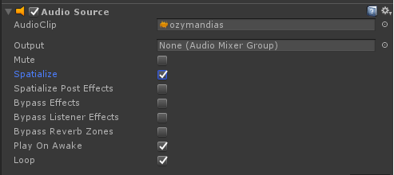

#### Direct Sound Settings
Steam Audio uses the following settings by default when spatializing an Audio Source:

- HRTF-based binaural rendering is enabled.
- Physics-based attenuation is off; the distance curve configured on the Audio Source is used.
- Frequency-dependent air absorption is off.
- Occlusion and transmission are off.
- Indirect sound (reflections and reverb) are off.

To change the default settings that are used by Steam Audio when spatializing an Audio Source, you must add a 
**Steam Audio Source** component to the GameObject containing the Audio Source component:

1.  Select the GameObject containing the Audio Source.
2.  In the Inspector view, click **Add Component**.
3.  In the Add Component menu, select **Steam Audio** > **Steam Audio Source**.

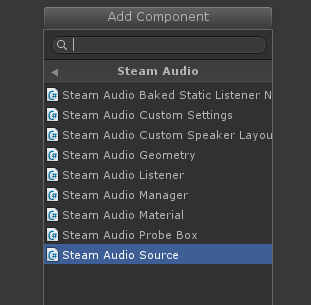

In this section, we only describe the direct sound settings for the Steam Audio Source component. **Direct sound 
settings can be changed while in Play mode in Unity** or programmatically while playing the game. Indirect sound 
settings will be discussed in a later section.

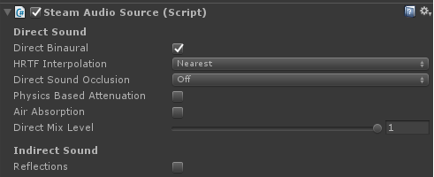

##### Direct Binaural
Check this box to enable HRTF-based 3D audio for direct sound. If unchecked, panning is used.

##### HRTF Interpolation
HRTF Interpolation specifies what interpolation scheme to use for HRTF-based 3D audio processing.

- **Nearest**. This option uses the HRTF from the direction nearest to the direction of the source for which HRTF data 
  is available.

- **Bilinear**. This option uses an HRTF generated after interpolating from four directions nearest to the direction of 
  the source, for which HRTF data is available. Bilinear HRTF interpolation may result in smoother audio for some kinds 
  of sources when the listener looks around, but has higher CPU usage (up to 2x) than Nearest HRTF interpolation.

##### Physics-Based Attenuation
When checked, physics-based distance attenuation (inverse distance falloff) is applied to the audio.

> **NOTE**  
  Physics-based attenuation is applied on top of any distance attenuation specified in the 3D Sound Settings of an Audio 
  Source. To avoid applying distance attenuation multiple times, you can uncheck Physics Based Attenuation on the
  Steam Audio Source. Alternatively, ensure that no distance attenuation is applied by the Audio Source, either by
  setting **Spatial Blend** to **2D** or by making the distance curve flat.

##### Air Absorption
When checked, frequency-dependent, distance-based air absorption is applied to the audio. Higher frequencies are
attenuated more quickly than lower frequencies over distance.

##### Direct Mix Level
Direct Mix Level adjusts the contribution of direct sound to the overall mix.

#### Occlusion
Steam Audio can model how sound is occluded by, and passes through, solid objects. Before changing any of the occlusion
settings described below, you must set up your scene geometry for use by Steam Audio; see the next section for details.

##### Direct Sound Occlusion
This specifies how occlusion is modeled, i.e., how solid objects affect sound passing through them.

- **Off**. Occlusion calculations are disabled. Sounds can be heard through walls and other solid objects. The scene
  setup does not need to be performed.

- **On, No Transmission**. Occlusion calculations are enabled. Occluded sound is inaudible.

- **On, Frequency Independent Transmission**. Occlusion calculations are enabled. Occluded sound is attenuated as it
  passes through geometry, based on the material properties of the occluding object. The attenuation is independent of
  frequency: the low, medium, and high frequency transmission coefficients are averaged, and the average value is used
  as a frequency-independent transmission coefficient.

- **On, Frequency Dependent Transmission**. Occlusion calculations are enabled. Occluded sound is filtered as it passes
  through geometry, based on the material properties of the occluding object. The filtering is dependent on frequency,
  so for example high frequencies may be attenuated more than low frequencies as the sound passes through geometry.

##### Occlusion Method
This dropdown is displayed whenever Direct Sound Occlusion is set to anything other than Off. It controls how
occlusion calculations are performed.

- **Raycast**. Performs a single raycast from the source to the listener to determine occlusion. If the ray is occluded, 
  direct sound is considered occluded. As described in the next section, the scene needs to be setup for Steam Audio.

- **Partial**. Performs multiple raycasts from the source to the listener based on the Source Radius setting. The 
  proportion of rays that are occluded determine how much of the direct sound is considered occluded. Transmission 
  calculations, if enabled, are only applied to the occluded portion of the direct sound. As described in next section, 
  the scene needs to be setup for Steam Audio.

##### Source Radius
This slider is only displayed when Occlusion Method is set to Partial. It configures the apparent size of the sound
source. The larger the source radius, the larger an object must be in order to fully occlude sound emitted by the
source.

#### Advanced Options
The following advanced options can be configured for a Steam Audio Source.

##### Avoid Silence During Init
Under some circumstances, Steam Audio Sources may take a few audio frames' worth of time to initialize. If this happens,
the default behavior is for a Steam Audio Source to emit silence while initialization is ongoing. Checking this box
modifies this behavior: the Steam Audio Source will pass its input audio unmodified while initialization is ongoing.

The default behavior is desirable for the common case where an occluded sound should not be audible for a few frames
while initialization occurs. On the other hand, for some kinds of sounds, like dialog, the default behavior may result
in the first few syllables becoming inaudible; checking this box will allow all the dialog to be heard.

### Scene Setup
To use Steam Audio for occlusion and environmental effects in your video game or VR experience, the scene needs to be 
set up by tagging geometry and specifying acoustic materials for the objects in your scene.

#### Tagging Geometry
Steam Audio needs to know what objects in your scene should be used to model occlusion and calculate environmental 
effects. You can specify this by tagging the relevant objects in multiple different ways.

##### Tagging Triangle Meshes
Any object with a Mesh Renderer component can be tagged with a **Steam Audio Geometry** component. Follow the steps 
below:

1.  Select the GameObject with Mesh Renderer you wish to tag.
2.  In the Inspector view, click **Add Component**.
3.  In the Add Component menu, click **Steam Audio** > **Steam Audio Geometry**.

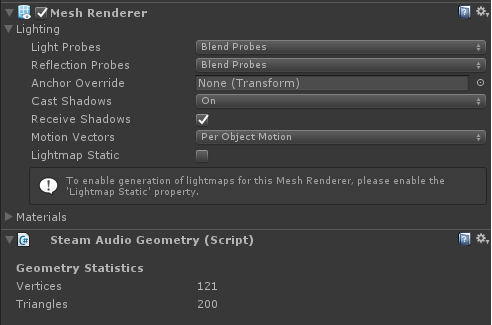

##### Tagging Terrain
Any object with a Terrain component can be tagged with a **Steam Audio Geometry** component.

Geometry that is represented by a Terrain component can be quite complex. This can slow down the calculation of 
occlusion and environmental effects. To speed things up, you can adjust the **Terrain Simplification Level** slider on 
the Steam Audio Geometry component. As you increase this value, Steam Audio will reduce the level of detail in the 
terrain. This will result in faster calculation of environmental effects.

##### Tagging a Hierarchy of Objects
A scene is often organized as a hierarchy of objects. The scene hierarchy can be seen in the Hierarchy window in Unity.

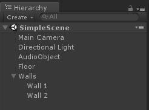

Any game object in the hierarchy window with child objects can tagged with a **Steam Audio Geometry** component. An 
option to **Export All Children** will be available in this case. If the option is selected, the geometry of all 
children with a **Mesh Renderer** or **Terrain** attached to them will be combined and used to model occlusion and 
environmental effects.

> **NOTE**  
  Tagging an object with Steam Audio Geometry does not require you to create an additional mesh first. Steam Audio can 
  directly use the same meshes used for visual rendering. Not all objects have a noticeable influence on environmental 
  effects. For example, in a large hangar, the room itself obviously influences the environmental effect. A small tin 
  can on the floor, though, most likely doesn’t. But large amounts of small objects can collectively influence the 
  environmental effects. For example, while a single wooden crate might not influence the hangar reverb, large stacks of 
  crates are likely to have some impact.

#### Specifying Acoustic Materials
After tagging objects, the next step is to tell Steam Audio what they are made of. You can specify the acoustic material 
of an object as follows:

1.  Select the GameObject whose material you wish to specify.
2.  In the Inspector view, click **Add Component**.
3.  In the Add Component menu, click **Steam Audio** > **Steam Audio Material**.

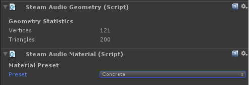

In the Steam Audio Material component that appears, click the **Preset** drop-down and choose a material preset.

##### Acoustic Material for Object Hierarchies
If you have an object with a Steam Audio Geometry component with Export All Children checked, and you attach a Steam 
Audio Material component to it, all its children are assigned the material of the root object. It is possible to assign 
a child object a different material by attaching a Steam Audio Material component to the child object.

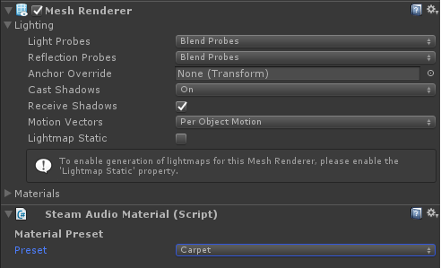

> **NOTE**  
  If a Steam Audio Material component is added to a child object in a hierarchy, the material will be assigned only 
  to the mesh or terrain attached to that particular child object. If the child object has its own children, the 
  material of the children objects will not be affected.

##### Global Default Materials
For scenes where most objects are made of the same material, barring a few exceptions, you can save time by specifying a 
global default material. Then, you only have to add Steam Audio Material components to objects whose material is 
different from the default. To specify a global default material:

1.  In Unity's main menu, click **Window** > **Steam Audio**.
2.  Choose a material from the **Material Preset** drop-down box.

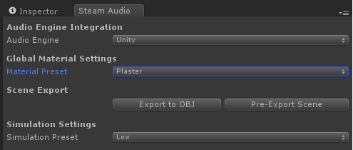

#### Adjusting Material Properties
Instead of choosing a material preset, you can use a custom material. To do so, select **Custom** from the Preset 
drop-down, either on a Steam Audio Material component, or for the global default material. Several sliders appear, 
allowing you to customize the material.

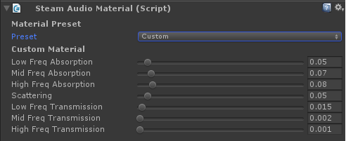

##### Absorption
The first three sliders, **Low Freq Absorption**, **Mid Freq Absorption**, and **High Freq Absorption**, let you specify 
how much sound the material absorbs at different frequencies. For example, setting High Freq Absorption to 1 means that 
the material absorbs all high frequency sound that reaches it. This adds a low-pass filtering effect to any sound 
reflected by the object.

> **NOTE**  
  The center frequencies for the three frequency bands are 400 Hz, 2.5 KHz, and 15 KHz.

##### Scattering
The fourth slider, **Scattering**, lets you specify how “rough” the surface is when reflecting sound. Surfaces with a 
high scattering value randomly reflect sound in all directions; surfaces with a low scattering value reflect sound in a 
mirror-like manner.

##### Transmission
The fifth through seventh sliders, **Low Freq Transmission**, **Mid Freq Transmission**, and **High Freq Transmission**,
let you specify how much sound the material transmits at different frequencies. For example, setting High Freq
Transmission to 0 means that no high frequency sound passes through the material. This adds a low-pass filtering effect
to any sound passing through the object.

> **NOTE**  
  The transmission coefficients are used only for direct sound occlusion calculations.

#### Scene Pre-Export
You must "pre-export" the scene before hitting Play in the Unity editor or building a player, to ensure scene setup 
changes are available to Steam Audio. To pre-export:

1.  In Unity’s main menu, click **Window** > **Steam Audio**.
2.  Click **Pre-Export Scene**.

### Indirect Sound
Steam Audio offers an easy way to add environmental effects to your video games and VR experiences. Before Steam 
Audio can apply environmental effects to the Audio Source, a **Steam Audio Source** component must be attached to the
Audio Source. This can be done as follows:

1.  Select the GameObject containing the Audio Source.
2.  In the Inspector view, click **Add Component**.
3.  In the Add Component menu, select **Steam Audio** > **Steam Audio Source**.

#### Indirect Sound Settings
The Steam Audio Source component tells Unity what settings to use when applying environmental effects to the audio 
emitted by an Audio Source. Indirect sound settings can be changed while in Play mode or programmatically.

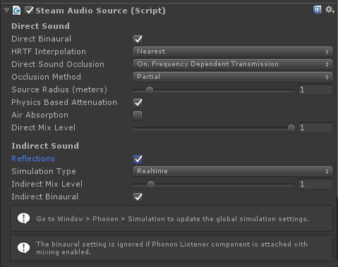

> **NOTE**  
  The Steam Audio Source component should be attached only to an Audio Source.

##### Reflections
If checked, Steam Audio will apply physics-based environmental effects to the audio emitted by the Audio Source. If 
unchecked, only direct sound settings (including occlusion) are applied.

##### Simulation Type
This determines what kind of simulation is performed to calculate environmental effects.

- **Realtime**. Environmental effects are continuously simulated in real-time, during gameplay. This allows for more 
  flexibility in incorporating changes to the scene and sources, but incurs a CPU overhead.

- **Baked Static Source**. The Audio Source must be static to use this simulation mode. Environmental effects are 
  precomputed from the source position during the design phase and saved with the scene. For largely static scenes, this 
  mode allows you to reduce CPU overhead at the cost of increased memory consumption.

- **Baked Static Listener**. The Audio Listener must be static or restricted to a few static positions to use this 
  simulation mode. The listener is free to look around but cannot move around. Environmental effects are precomputed 
  at a pre-determined listener position during the design phase and saved with the scene. Audio Sources can freely move 
  when using this mode. For a VR experience where the camera can only transport to a few locations, this mode allows you 
  to reduce CPU overhead at the cost of increased memory consumption.

##### Indirect Mix Level
Indirect Mix Level adjusts the contribution of indirect sound to the overall mix.

##### Indirect Binaural
If checked, renders indirect sound with HRTF-based 3D audio. This gives a better sense of directionality to indirect 
sound and improves immersion. There is a small increase in CPU overhead when checked.

#### Accelerated Mixing
If you are using Audio Mixers in your project, you can use the Steam Audio Mixer Return effect to reduce the CPU
overhead of audio processing for environmental effects. This can be done as follows:

1.  In the Audio Mixer view, select the Audio Mixer you want to use for mixing indirect sound.
2.  In any Mixer Group, click **Add Effect**, and choose **Steam Audio Mixer Return**.

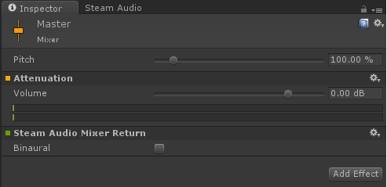

When using the Steam Audio Mixer Return effect, the following things happen:

- If indirect sound is enabled for a Steam Audio Source, then the indirect sound for that source is _not_ sent to the
  Audio Source's output. It is retained internally by Steam Audio for mixing. Only direct sound is sent to the
  Audio Source's output.

- All of the indirect sound for all Steam Audio Sources is mixed, and inserted back into the audio pipeline at the
  Mixer Group to which the Steam Audio Mixer Return effect has been added.

- Since indirect sound is taken out of Unity's audio pipeline at the Audio Source, any effects applied between the
  Audio Source and the Steam Audio Mixer Return effect will not apply to indirect sound.

##### Steam Audio Mixer Return Settings
The following settings can be configured on a Steam Audio Mixer Return effect:

###### Binaural
If checked, applies HRTF-based 3D audio rendering to indirect sound.

> **NOTE**  
  When a Steam Audio Mixer Return effect is attached to an Audio Mixer, the Binaural setting of the Steam Audio 
  Mixer Return effect overrides the Indirect Binaural settings on Steam Audio Source components in the scene.

##### Advanced Options
The following advanced options can be configured for a Steam Audio Mixer Return effect.

###### Avoid Silence During Init
Under some circumstances, Steam Audio Mixer Return effects may take a few audio frames' worth of time to initialize. If 
this happens, the default behavior is for a Steam Audio Mixer Return effect to emit silence while initialization is 
ongoing. Checking this box modifies this behavior: the Steam Audio Mixer Return effect will pass its input audio 
unmodified while initialization is ongoing.

The default behavior is desirable for the common case where an occluded sound should not be audible for a few frames
while initialization occurs. On the other hand, for some kinds of sounds, like dialog, the default behavior may result
in the first few syllables becoming inaudible; checking this box will allow all the dialog to be heard.

#### Simulation Settings
Steam Audio allows you to balance its compute requirements and simulation output quality. To adjust these settings:

1.  In Unity’s main menu, click **Window** > **Steam Audio**.
2.  Under **Simulation Preset**, choose from Low, Medium, High, or Custom.

##### Custom Preset for Simulation Settings
The custom simulation preset lets you configure various aspects of how Steam Audio simulates indirect sound. These 
options cannot be changed in Play mode or programmatically.

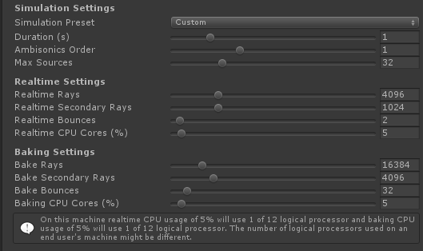

- **Duration**. This is the length of the impulse responses to generate. Increasing this improves the quality of the 
  simulation, but beyond a certain point (depending on the number of sound sources), may result in audio glitching.

- **Ambisonics Order**. This determines the directionality of environmental effects. Increasing this increases the 
  compute complexity quadratically. Use zero order Ambisonics if no directionality is needed in environmental effects. 
  Otherwise, first order Ambisonics should provide a good tradeoff between directionality and CPU usage.

- **Max Sources**. This is the maximum number of Steam Audio Sources and Steam Audio Reverb effects combined that can 
  be used for modeling indirect sound.

- **Realtime Rays**. This is the number of primary and reflection rays to trace from the listener position for real-time 
  computation of environmental effects. Increasing this improves the quality of the simulation, at the cost of 
  performance.

- **Realtime Secondary Rays**. This is the number of directions that are sampled when simulating diffuse reflection. 
  Setting this number too low may reduce the overall quality.

- **Realtime Bounces**. Number of times the rays are allowed to bounce off of solid objects in real-time. Increasing 
  this improves the quality of the simulation, at the cost of performance.

- **Bake Rays**. This is the number of primary and reflection rays to trace from the listener position for baked 
  computation of environmental effects. Increasing this improves the quality of the simulation while increasing the 
  overall time to bake environmental effects.

- **Bake Secondary Rays**. This is the number of directions that are sampled when simulating diffuse reflection. Setting 
  this number too low may reduce the overall quality.

- **Bake Bounces**. Number of times the rays are allowed to bounce off of solid objects during baking. Increasing this 
  improves the quality of the simulation while increasing the overall time to bake environmental effects.

### Reverb
Steam Audio also lets you apply listener-centric reverb to audio flowing through any Mixer Group in Unity. This helps
reduce CPU usage, since indirect sound effects are applied after multiple sounds are mixed. When using listener-centric
reverb, Steam Audio calculates and applies a reverb filter based on the listener's position in the scene; it does not
take source positions into account.

To use Steam Audio for modeling listener-centric reverb:

1.  In the Audio Mixer tab, select the Mixer Group to which you want to apply listener-centric reverb.
2.  Click **Add Effect**, then choose **Steam Audio Reverb**.

After doing this, Steam Audio will apply listener-centric reverb to all audio reaching the Mixer Group, either from
Audio Sources whose output is set to the Mixer Group, or from other Mixer Groups that route audio to the selected
Mixer Group.

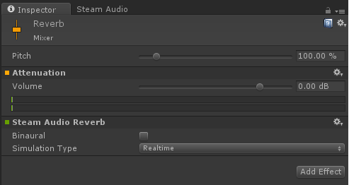

The following settings can be configured for the Steam Audio Reverb effect:

#### Simulation Type
Simulation Type determines what kind of simulation is performed to calculate reverb.

- **Realtime**. Reverb is continuously simulated in real-time, during gameplay. This allows for more flexibility 
  in incorporating changes to the scene and sources, but incurs a CPU overhead.

- **Baked**. Reverb is precomputed over a grid of listener positions during the design phase and saved with the 
  scene. For largely static scenes, this mode allows you to reduce CPU overhead at the cost of increased memory 
  consumption.

#### Binaural
If checked, applies HRTF-based 3D audio rendering to reverb.

> **NOTE**  
  Listener-centric reverb (using the Steam Audio Reverb effect) and accelerated mixing (using the Steam Audio Mixer
  Return effect) are mutually-exclusive features. You cannot use both kinds of effects at the same time.

#### Advanced Options
The following advanced options can be configured for a Steam Audio Reverb effect.

##### Avoid Silence During Init
Under some circumstances, Steam Audio Reverb effects may take a few audio frames' worth of time to initialize. If this 
happens, the default behavior is for a Steam Audio Reverb effect to emit silence while initialization is ongoing. 
Checking this box modifies this behavior: the Steam Audio Reverb effect will pass its input audio unmodified while 
initialization is ongoing.

The default behavior is desirable for the common case where an occluded sound should not be audible for a few frames
while initialization occurs. On the other hand, for some kinds of sounds, like dialog, the default behavior may result
in the first few syllables becoming inaudible; checking this box will allow all the dialog to be heard.

### 3D Audio For Indirect Sound
Steam Audio provides the following ways of applying HRTF-based 3D audio rendering to indirect sound:

- If not using accelerated mixing, you can check Indirect Binaural on an individual Steam Audio Source.
- If using accelerated mixing, you can check Indirect Binaural on the Steam Audio Mixer Return effect.
- If using listener-centric reverb, you can check Indirect Binaural on the Steam Audio Reverb effect.

### Baking Indirect Sound
A few additional steps need to be performed to use the **Baked Static Source** or **Baked Static Listener** options in a 
Steam Audio Source and the **Baked** setting in a Steam Audio Reverb effect. You must create probe boxes, assign them 
in the Steam Audio Source component or Steam Audio Reverb effect, and perform a bake.

#### Creating Probe Boxes
Steam Audio uses _probes_ to store baked environmental effect data. A Probe Box is a way to create and manage probes. To 
create a Probe Box:

1.  In Unity’s main menu, click **GameObject** > **Create Empty**.
2.  In the Hierarchy view, give the newly-created GameObject any preferred name. **All Probe Boxes should have a unique 
    name.**
3.  In the Inspector view, click **Add Component**.
4.  In the Add Component menu, click **Steam Audio** > **Steam Audio Probe Box**.
5.  Adjust the position and size of the Probe Box using Unity's translate, rotate, and scale tools.
6.  Choose an appropriate **Placement Strategy**. (See below for details.)
7.  Click **Generate Probes**.

##### Dimensions
A Probe Box is a parallelopiped volume. The position, shape, and scale of the probe box is determined by the local to
world transformation matrix of the GameObject to which Probe Box component is attached.

##### Placement Strategy
Steam Audio currently supports the following strategies to generate probes within a Probe Box.

- **Centroid**. Places a single probe at the center of the Probe Box.

- **Uniform Floor**. Places probes at a certain height above the floor in the direction of the local down vector of 
  the probe box with a certain spacing between them. The height is specified by the **Height Above Floor** parameter. 
  Spacing is specified by the **Horizontal Spacing** parameter.

##### Probe Box Statistics
Probe Box Statistics provides information about the number of probes and the size of the baked data at the probes.

#### Baked Reverb Settings
To configure baked reverb, you must first add a Steam Audio Listener component to the GameObject that contains the
Unity Audio Listener component:

1.  Select the GameObject containing the Audio Listener.
2.  In the Inspector view, click **Add Component**.
3.  In the Add Component menu, click **Steam Audio** > **Steam Audio Listener**.

Baked Reverb Settings will be displayed in the Steam Audio Listener component. The environmental effect that is baked at 
a probe's location represents the reverb at that location.

##### Use All Probe Boxes
If checked, all Probe Boxes are used when baking reverb. If unchecked, you can specify a list of Probe Boxes for which 
to bake reverb.

#### Baked Static Source Settings
Baked Static Source settings will be displayed in a Steam Audio Source component when its Simulation Type is set to 
Baked Static Source. The environmental effect that is baked at a probe's location represents sound propagation from the 
source location to the probe's location.

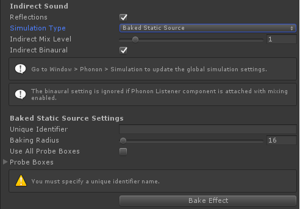

##### Unique Identifier
Each Steam Audio Source whose Simulation Type is set to Baked Static Source must have a unique identifier.

##### Baking Radius
Environmental effects are baked for all probes within the baking radius of a Steam Audio Source. A smaller baking radius 
implies fewer probes need to be baked, so less data needs to be stored.

##### Use All Probe Boxes
If checked, all Probe Boxes are used when baking environmental effects for the source. If unchecked, you can specify a 
list of Probe Boxes for which to bake environmental effects.

#### Baked Static Listener Settings
To use Baked Static Listener simulation on a Steam Audio Source, you must first create one or more **Steam Audio Baked
Static Listener Node** components. You must also add and configure a Steam Audio Listener component to the Audio 
Listener.

##### Baked Static Listener Nodes
One or more **Steam Audio Baked Static Listener Node** components must be attached to GameObjects at the fixed locations 
to which Audio Listener can transport. Bakes performed at each Baked Static Listener Node represent sound propagation 
from each probe location to the location of the static listener node.

###### Unique Identifier
Each Steam Audio Baked Static Listener Node component must have a unique identifier.

###### Baking Radius
Environmental effects are baked for all probes within the baking radius of a Baked Static Listener Node. A smaller 
baking radius implies fewer probes need to be baked, so less data needs to be stored.

###### Use All Probe Boxes
If checked, all Probe Boxes are used when baking environmental effects for the static listener. If unchecked, you can 
specify a list of Probe Boxes for which to bake environmental effects.

##### Steam Audio Listener configuration
A **Steam Audio Listener** component needs to be attached to the Audio Listener when Simulation Type is set to Baked 
Static Listener for any Steam Audio Source component. The following settings must be configured:

##### Current Static Listener Node
Points to the latest Steam Audio Baked Static Listener Node where the Audio Listener is located.

> **NOTE**  
  You must also attach Baked Static Listener Node components to use Baked Static Listener settings in a Steam Audio
  Source.

#### Baking
Click **Bake** on a Steam Audio Source or Steam Audio Listener component to bake the corresponding environmental 
effects. The baked data is stored in the Probe Boxes selected within Steam Audio Source or Steam Audio Listener 
components.

##### Baked Data Statistics
Baked data statistics for a component are readily available in a foldout at the end of the component. The actual name of 
the foldout may vary depending on the component baked, i.e. Steam Audio Source, Steam Audio Listener, or Steam Audio 
Baked Static Listener Node.

### Advanced Options
The following advanced options are available on the Steam Audio tab.

#### AMD TrueAudio Next
Steam Audio provides optional support for AMD TrueAudio Next, which allows you to reserve a portion of the GPU for
accelerating convolution operations. TrueAudio Next requires a supported AMD Radeon GPU. 

If you choose to enable TrueAudio Next support in your Unity project, then Steam Audio will try to use the GPU to 
accelerate the rendering of indirect sound, including real-time source-centric propagation, baked static source 
propagation, baked static listener propagation, real-time listener-centric reverb, and baked listener-centric reverb.

> **NOTE**  
  TrueAudio Next only supports Windows 64-bit platform. Steam Audio falls back to using CPU based convolution for
  platforms not supported by TrueAudio Next.

##### Enabling TrueAudio Next
Before enabling TrueAudio Next, you must download the Steam Audio TrueAudio Next support package for Unity
(`SteamAudio_TrueAudioNext.unitypackage`) from GitHub. Then:

1.  From the Unity menu, choose **Assets** > **Import Package** > **Custom Package**.
2.  Navigate to the directory where you downloaded the Steam Audio TrueAudio Next support package. Within this
    folder, navigate to the <code>bin/unity/</code> subdirectory.
3.  Double-click the <code>SteamAudio_TrueAudioNext.unitypackage</code> file.
4.  In the Import dialog box that appears, make sure everything is selected, and click the **Import** button.

Next, for each Unity scene in which you want to enable TrueAudio Next, follow these steps:

1.  In the Hierarchy tab, click the **Steam Audio Manager Settings** object.
2.  In the Inspector tab, click **Add Component**.
3.  In the Add Component menu, select **Steam Audio** > **Steam Audio Custom Settings**.
4.  In the Steam Audio Custom Settings component, set **Convolution Option** to **TrueAudio Next**.

Now whenever the scene is loaded, either in the Unity editor or in a standalone player, Steam Audio will attempt
to use TrueAudio Next for convolution. If the user's PC does not contain a supported GPU (or the configured
resource reservation settings are not supported by the user's GPU; see below for details), Steam Audio will
seamlessly fall back to using the CPU for convolution, as usual.

> **NOTE**  
  When using TrueAudio Next, we strongly recommend that you use the Steam Audio Mixer Return effect if possible,
  for the best performance.

##### Settings Overrides
When TrueAudio Next is enabled in the Steam Audio Custom Settings component, you can also override some of the
simulation settings that are normally configured on the Steam Audio Manager Settings component. These include
**Duration**, **Ambisonics Order**, and **Max Sources**.

These overrides allow you to switch to a higher level of acoustic detail when the user's PC has a supported
GPU, while seamlessly falling back to using the CPU with the settings configured on the Steam Audio Manager
Settings component if a supported GPU is not found.

##### Resource Reservation
When TrueAudio Next is enabled in the Steam Audio Custom Settings component, you can configure the following
Resource Reservation settings, which allow you to control how much of the GPU is set aside for audio processing
tasks:

- **Min Compute Units To Reserve**. This is the smallest number of GPU Compute Units (CUs) that should be possible
  to reserve for audio processing. If the user's GPU does not support this many reserved CUs, then TrueAudio Next
  initialization will fail and Steam Audio will fall back to CPU convolution. For example, if this value is set to 4,
  but the user's GPU only supports reserving up to 2 CUs, TrueAudio Next initialization will fail.

- **Max Compute Units To Reserve**. This is the largest number of CUs that Steam Audio will try to reserve for audio
  processing. Steam Audio will try to reserve as many CUs as it can, up to this limit. If the user's GPU does not
  support reserving any number of CUs between **Min Compute Units To Reserve** and **Max Compute Units To Reserve**,
  then TrueAudio Next initialization will fail and Steam Audio will fall back to CPU convolution. For example, if
  **Min Compute Units To Reserve** is set to 2 and **Max Compute Units To Reserve** is set to 4, but the user's GPU
  only supports reserving 8 or more CUs, TrueAudio Next initialization will fail.

#### Per Frame Query Optimization
Steam Audio searches the Unity scene graph for an Audio Listener and a Steam Audio Listener every frame. This requires 
making an expensive <code>FindObjectOfType</code> call per frame in Unity. When **Update Component** is unchecked in 
Per Frame Query Optimization, this per frame call to <code>FindObjectOfType</code> will not be made. This option should 
be used if the Audio Listener or Steam Audio Listener are not expected to change during the game.

#### Consolidated Baking Options
Provides a single place for generating probes and baking data for various Steam Audio components. This option is 
provided primarily for convenience in accessing all baking-related functionality from one place. It is still possible to 
generate probes and bake data individually for each component.

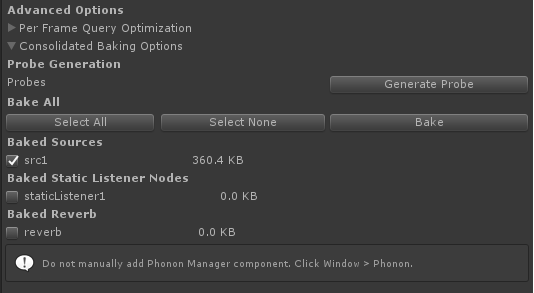
