% Steam Audio Unreal Engine 4 Plugin

# Steam Audio Unreal Engine 4 Plugin
**Steam&reg; Audio, Copyright 2016 - 2018, Valve Corp. All rights reserved.**

## Introduction

Thanks for trying out Steam Audio. It is a complete solution to add 3D audio and environmental effect to your game or VR
experience. It has the following capabilities:

- **3D audio for direct sound.** Steam Audio binaurally renders direct sound using HRTFs to accurately model the
  direction of a sound source relative to the listener. Users can get an impression of the height of the source, as well
  as whether the source is in front of or behind them.

- **Occlusion and partial occlusion**. Steam Audio can quickly model raycast occlusion of direct sound by solid objects.
  Steam Audio also models partial occlusion for non-point sources.

- **Model a wide range of environmental effects.** Steam Audio can model many kinds of environmental audio effects,
  including slap echoes, flutter echoes, occlusion of sound by buildings, propagation of occluded sound along alternate
  paths, through doorways, and more.

- **Create environmental effects and reverbs tailored to your scene.** Steam Audio analyzes the size, shape, layout, and
  material properties of rooms and objects in your scene. It uses this information to automatically calculate
  environmental effects by simulating the physics of sound.

- **Automate the process of creating environmental effects.** With Steam Audio, you don’t have to manually place effect
  filters throughout your scene, and you don’t have to manually tweak the filters everywhere. Steam Audio uses an
  automated real-time or pre-computation based process where environmental audio properties are calculated (using
  physics principles) throughout your scene.

- **Generate high-quality convolution reverb.** Steam Audio can calculate convolution reverb. This involves calculating
  Impulse Responses (IRs) at several points throughout the scene. Convolution reverb results in compelling environments
  that sound more realistic than with parametric reverb. This is particularly true for outdoor spaces, where parametric
  reverbs have several limitations.

- **Head tracking support.** For VR applications, Steam Audio can use head tracking information to make the sound field
  change smoothly and accurately as the listener turns or moves their head.

### How Steam Audio Works

This section describes the various parts of Steam Audio, focusing on the way in which the computational load is divided
between multiple threads. Steam Audio interacts with three main threads:

1. **Game Thread**. This thread controls the game state, and sends this information to the Simulation Thread. This
   thread is managed by the game engine, and runs as fast as the game engine chooses to execute it, which might be 60 Hz
   assuming vsync is enabled.

2. **Simulation Thread.** This thread actually carries out the sound propagation simulation, and performs the bulk of
  the computational work. It uses source and listener information provided by the Game Thread, and calculates an impulse
  response for use by the Rendering Thread. This process involves ray tracing. This thread is managed internally by
  Steam Audio, and runs as fast as it can, but no faster than the Rendering Thread.

3. **Rendering Thread.** This thread applies direct occlusion, 3D audio, and environmental effects to each sound source.
  Steam Audio inserts DSP code into the main audio thread, to perform convolutions with multi-channel impulse responses.
  This thread runs at the audio DSP rate, which is typically 1024 samples per frame, and 44100 samples per second.

### Integration and Platforms

Steam Audio supports **Unreal Engine 4.20 or higher**. If you are using Unity, refer to the _Steam Audio Unity Plugin
Manual_. If you are using a different game engine or audio middleware, you will need to use the Steam Audio C API.
Refer to the *Steam Audio API Reference* for further information.

The Steam Audio Unreal Engine 4 plugin currently supports Windows 7 or later, and Android.

## Unreal Engine 4 Integration

This chapter explains how to use Steam Audio with Unreal Engine. It assumes that you are using Unreal's built-in audio engine.

### Enabling Audio Mixer Functionality
Steam Audio requires the latest Audio Mixer functionality available in Unreal Engine 4.20 onwards. In Unreal 4.20, this functionality is disabled by default. To enable it, you must first create a shortcut to the Unreal Engine editor:

1. In the Epic Games Launcher, click **Library**.
2. Click the down arrow next to the Unreal Engine version you want to use, and click **Create
   Shortcut**.

You can use any other method to create a shortcut to the editor.

Next, you must modify the command-line arguments used when launching the editor using the shortcut:

1. Right-click the shortcut to the Unreal editor and click **Properties**.
2. In the **Shortcut** tab, under **Target**, add <code>-audiomixer</code> at the end of the command line.
3. Click **OK**.

### Enabling Steam Audio
Before using Steam Audio with Unreal, you must enable it for your project. To do so:

1. In the Unreal Editor main menu, click **Edit** > **Plugins**.
2. In the left pane of the Plugins window, under **Built-In**, click **Audio**.
3. Scroll the list of plugins until you see **Steam Audio**, then check **Enabled**.


### Enabling Individual Plugins
Unreal allows users to individually configure spatialization, occlusion, and reverb
plugins, per-platform. For example, you may choose to use Steam Audio's spatialization
plugin on Windows and Android, but use default spatialization on PS4.

To get started on Windows:

1. In the Unreal Editor main menu, click **Edit** > **Project Settings**.
2. In the **Platforms** section, select **Windows**.
3. In the **Audio** section, you will see three dropdowns. Change these to **Steam Audio**.
4. Restart the editor.

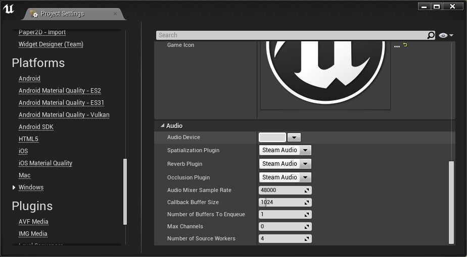

### 3D Audio for Direct Sound
Steam Audio offers the easiest way to add HRTF-based 3D audio for video games and VR experiences. To add 3D audio,
without adding any occlusion or environmental effects, follow the steps in this section.

You can apply Steam Audio spatialization to any Actor in your scene that contains an Audio Component. To do this:

1. In the **World Outliner** tab, select the Actor that contains the Audio Component you want to spatialize.
2. In the **Details** tab, select the Audio Component you want to spatialize.
3. Under **Attenuation Spatialization**, check **Override Attenuation**.
4. In the **Spatialization Method** drop-down, select **Binaural**.


This configures Steam Audio to use HRTF-based binaural rendering for this sound. If you want to fine-tune how the
spatialization is performed, you can configure advanced spatialization settings as described in the next section.

#### Spatialization Settings
If you want to configure how Steam Audio spatializes a sound, follow these steps:

1. Select the Audio Component whose spatialization settings you want to modify.
2. Under **Attenuation Plugin Settings**, expand the **Plugin Settings** section.
3. Add an element to the **Spatialization Plugin Settings** array.
4. If you have already created a Spatialization Settings asset, you can select it from the list. Otherwise, click
   **Phonon Spatialization Source Settings** under **Create New Asset**.
5. Give the newly-created asset any name you prefer, then double-click it in the **Content Browser** tab.

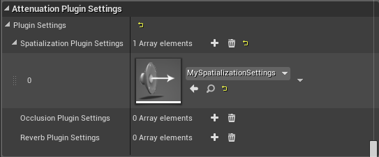

In the window that opens, you can configure the following settings:

##### Spatialization Method
Select _HRTF_ to use Steam Audio's HRTF-based binaural rendering algorithm (this is the default). You can also select
_Panning_ to revert to a standard panning algorithm. This is mostly useful for comparison purposes only.

##### HRTF Interpolation Method
HRTF Interpolation specifies what interpolation scheme to use for HRTF-based 3D audio processing:

- **Nearest**. This option uses the HRTF from the direction nearest to the direction of the source for which HRTF data
  is available.

- **Bilinear**. This option uses an HRTF generated after interpolating from four directions nearest to the direction of
  the source, for which HRTF data is available. Bilinear HRTF interpolation may result in smoother audio for some kinds
  of sources when the listener looks around, but has higher CPU usage than Nearest HRTF interpolation.


### Occlusion for Direct Sound
Steam Audio lets you model occlusion of direct sound, i.e., the sound that reaches the listener directly from the
source. Before you can use the occlusion functionality of Steam Audio, you must tag and export the scene as
described in the next section.

To enable occlusion for a sound source:

1. Select the Audio Component to which you want to apply occlusion effects.
2. Under **Attenuation Plugin Settings**, expand the **Plugin Settings** section.
3. Add an element to the **Occlusion Plugin Settings** array.
4. If you have already created an Occlusion Settings asset, you can select it from the list. Otherwise, click
   **Phonon Occlusion Source Settings** under **Create New Asset**.
5. Give the newly-created asset any name you prefer, then double-click it in the **Content Browser** tab.

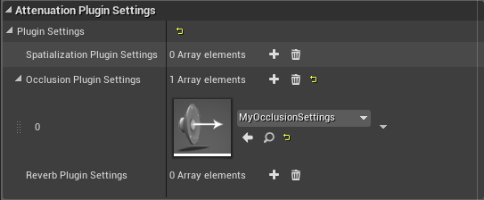

This configures Steam Audio's occlusion algorithm with the default settings. To fine-tune how Steam Audio models
occlusion for your sound, you can configure advanced occlusion settings as described in the next section.

#### Occlusion Settings
In the **Content Browser** tab, double-click the Occlusion Settings asset you created. In the window that opens, you
can configure how Steam Audio models occlusion.

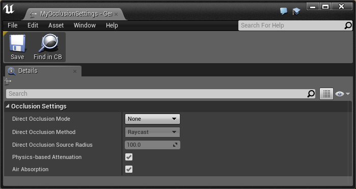

##### Direct Occlusion Mode
Direct Occlusion Mode specifies how to model sources that are occluded by solid objects.

- **None**. Occlusion calculations are disabled. Sounds can be heard through walls and other solid objects.

- **Direct Occlusion, No Transmission**. Occlusion calculations are enabled. Occluded sound is inaudible.

- **Direct Occlusion, Frequency Independent Transmission**. Occlusion calculations are enabled. Occluded sound is attenuated as it
  passes through geometry, based on the material properties of the occluding object. The attenuation is independent of
  frequency.

- **Direct Occlusion, Frequency Dependent Transmission**. Occlusion calculations are enabled. Occluded sound is filtered as it passes
  through geometry, based on the material properties of the occluding object. The filtering is dependent on frequency,
  so for example high frequencies may be attenuated more than low frequencies as the sound passes through geometry.

##### Direct Occlusion Method
This dropdown is enabled whenever Direct Occlusion Mode is set to anything other than None. Specifies the algorithm used by
Steam Audio for modeling occlusion. The options are:

- **Raycast**. Performs a single ray cast from source to the listener to determine occlusion. If the ray is occluded,
  direct sound is blocked.

- **Partial**. Performs multiple ray casts from source to the listener, treating the source as a sphere with a specified
  radius. The volume of the sound source is adjusted based on the portion of the source visible from the listener. Transmission calculations,
  if enabled, are only applied to the occluded portion of the direct sound.

##### Direct Occlusion Source Radius
Specifies the radius of the sphere to use when modeling Partial occlusion. Ignored if Direct Occlusion Method is set to
Raycast.

##### Physics-Based Attenuation
When checked, physics-based distance attenuation (inverse distance falloff) is applied to the audio.

> **NOTE** <br/>
> Physics-based attenuation is applied on top of any distance attenuation specified in the Attenuation Settings of an
Audio Component. To avoid applying distance attenuation multiple times, either uncheck Physics Based Attenuation in
the Occlusion Settings asset for a source, or ensure that no distance attenuation is applied by the Audio Component.

##### Air Absorption
When checked, frequency-dependent, distance-based air absorption is applied to the audio. Higher frequencies are
attenuated more quickly than lower frequencies over distance.

### Scene Setup
To use Steam Audio for occlusion and environmental effects in your video game or VR experience, the scene needs to be
set up by tagging geometry and specifying acoustic materials for the objects in your scene.

#### Tagging Geometry
Steam Audio needs to know what objects in your scene should be used to model occlusion and calculate environmental
effects. You can specify this by tagging the relevant objects in multiple different ways.

##### Tagging Static Meshes
Any Actor with a Static Mesh component can be tagged with a **Phonon Geometry** component:

1. Select the Actor containing the Static Mesh Component you wish to tag.
2. Click **Add Component**.
3. Select **Phonon Geometry**.

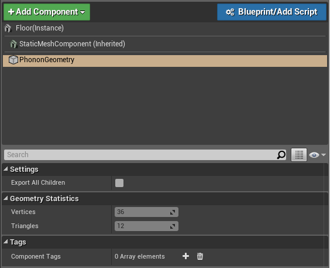

##### Tagging Static Meshes in Bulk
You may also add or remove Phonon Geometry components from all static mesh actors in
the scene by using buttons provided in the Steam Audio editor mode.

1. Click on the Steam Audio editor mode.
2. Click on **Add All** or **Remove All** to add or remove from all actors.


##### Tagging Landscape Terrain
In the current version of Steam Audio for Unreal Engine 4, you cannot select individual parts of Landscape terrain to
use for physics-based environmental audio simulation. You can either use all terrain in a scene, or none of it. To
configure Steam Audio to use Landscape terrain:

1. In the main menu, click **Edit** > **Project Settings**.
2. In the Project Settings window, under **Plugins**, click **Steam Audio**.
3. Under **Scene Export**, check **Export Landscape Geometry**.

##### Tagging BSP Geometry
In the current version of Steam Audio for Unreal Engine 4, you cannot select individual parts of BSP geometry to use
for physics-based environmental audio simulation. You can either use all BSP geometry in a scene, or none of it. To
configure Steam Audio to use BSP geometry:

1. In the main menu, click **Edit** > **Project Settings**.
2. In the Project Settings window, under **Plugins**, click **Steam Audio**.
3. Under **Scene Export**, check **Export BSP Geometry**.


##### Tagging a Hierarchy of Objects
To tag a large number of Static Mesh Actors that share a common parent object in the World Outliner view:

1. Select the parent Actor of all the Actors you wish to tag.
2. Click **Add Component**, then select **Phonon Geometry**.
3. Select the **Phonon Geometry** component, then under **Settings**, click **Export All Children**.

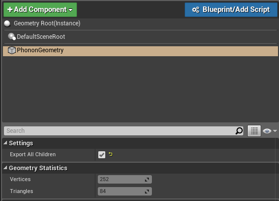

> **NOTE** <br/>
> Tagging an object with Phonon Geometry does not require you to create an additional mesh first. Steam Audio can
  directly use the same meshes used for visual rendering. Not all objects have a noticeable influence on environmental
  effects. For example, in a large hangar, the room itself obviously influences the environmental effect. A small tin
  can on the floor, though, most likely doesn’t. But large amounts of small objects can collectively influence the
  environmental effect. For example, while a single wooden crate might not influence the hangar reverb, large stacks of
  crates are likely to have some impact.

#### Specifying Acoustic Materials
After tagging objects, the next step is to tell Steam Audio what they are made of. You can specify the acoustic
material of an object as follows:

- Select the Actor whose material you wish to specify.
- In the **Details** view, click **Add Component**.
- Select **Phonon Material**.

In the Phonon Material component that appears, click the **Material Preset** drop-down and choose a material preset.

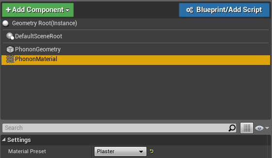

##### Acoustic Material for Object Hierarchies
If you have an object with a Phonon Geometry component with Export All Children checked, and you attach a Phonon
Material component to it, all its children are assigned the material of the root object. It is possible to assign a
child object a different material by attaching a Phonon Material component to the child object.

##### Global Default Materials
For scenes where most objects are made of the same material, barring a few exceptions, you can save time by specifying
a global default material. Then, you only have to add Phonon Material components to objects whose material is different
from the default. To specify a global default material:

1. In the main menu, click **Edit** > **Project Settings**.
2. In the Project Settings window, under **Plugins**, click **Steam Audio**.
3. Under **Default Static Mesh Material**, select a preset from the **Material Preset** drop-down.
4. Under **Default Landscape Material**, select a preset from the **Material Preset** drop-down.
5. Under **Default BSP Material**, select a preset from the **Material Preset** drop-down.


#### Adjusting Material Properties
Instead of choosing a material preset, you can use a custom material. To do so, select **Custom** from the Material
Preset drop-down, either on a Phonon Material component, or for the global default materials. Seven sliders appear,
allowing you to customize the material.

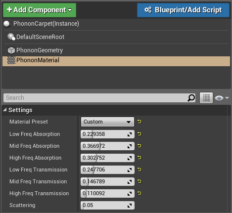

##### Absorption
The first three sliders, **Low Frequency Absorption**, **Mid Frequency Absorption**, and **High Frequency Absorption**,
let you specify how much sound the material absorbs at different frequencies. For example, setting High Frequency
Absorption to 1 means that the material absorbs all high frequency sound that reaches it. This adds a low-pass
filtering effect to any sound reflected by the object.

> **NOTE** <br/>
> The center frequencies for the three frequency bands are 800 Hz, 4 KHz, and 15 KHz.

##### Transmission
The fourth through sixth sliders, **Low Freq Transmission**, **Mid Freq Transmission**, and **High Freq Transmission**,
let you specify how much sound the material transmits at different frequencies. For example, setting High Freq
Transmission to 0 means that no high frequency sound passes through the material. This adds a low-pass filtering effect
to any sound passing through the object.

##### Scattering
The seventh slider, **Scattering**, lets you specify how "rough" the surface is when reflecting sound. Surfaces with a
high scattering value randomly reflect sound in all directions; surfaces with a low scattering value reflect sound in a
mirror-like manner.

#### Scene Export
You must "export" the scene before hitting Play in the Unreal editor or building a player, to ensure scene setup changes
are available to Steam Audio. To export:

1. Click on the **Steam Audio** editor mode.
2. Click on **Export Scene**.


After exporting, you should see the number of triangles in the scene and overall
data size. If you wish to view the scene that will be used by Steam Audio, you may
export to an OBJ file by clicking **Export OBJ**. The resulting OBJ file may be loaded and viewed in the Unreal editor.

### Environmental Audio Effects
Steam Audio lets you add physics-based environmental audio effects, including reflections, reverberation, and
occlusion. Environmental effects, which model the interactions between sound and the environment, are also known as
_indirect sound_, in contrast with _direct sound_, which models the sound reaching the listener directly from the
source.

There are multiple ways in which you can use Steam Audio for indirect sound effects.

#### Per-Source Sound Propagation
Steam Audio can simulate how the environment affects a sound as it flows from the source to the listener. To enable
this:

1. In the **Details** tab, select the Audio Component for which you want to enable sound propagation.
2. Under **Attenuation Plugin Settings**, expand the **Plugin Settings** section.
3. Add an element to the **Reverb Plugin Settings** array.
4. If you have already created an Reverb Settings asset, you can select it from the list. Otherwise, click
   **Phonon Reverb Source Settings** under **Create New Asset**.
5. Give the newly-created asset any name you prefer, then double-click it in the **Content Browser** tab.

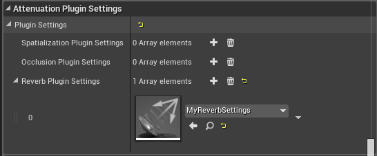

This configures Steam Audio's sound propagation algorithm with the default settings for this source. To fine-tune
sound propagation settings for this source, in the **Content Browser** tab, double-click the Reverb Settings asset you
created. In the window that opens, you can configure the following settings:

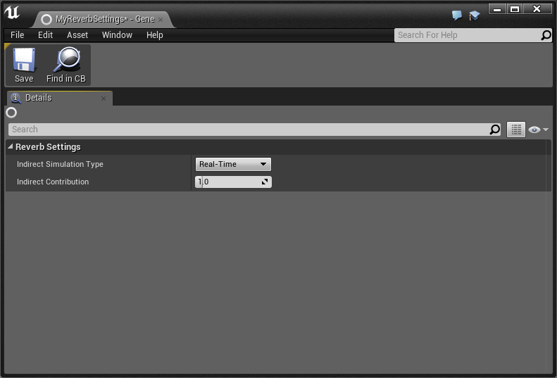

##### Indirect Contribution
Increasing this value increases the contribution of indirect sound relative to the overall mix for this source.

#### Listener-Centric Reverb
Steam Audio can also use physics-based environmental audio simulation to apply a single reverb to all audio reaching
the listener, based on the listener's position. To enable this:

1. In the main menu, click **Edit** > **Project Settings**.
2. In the left pane, under **Plugins**, select **Steam Audio**.
3. In the **Reverb Simulation Type** drop-down, select **Real-Time**.

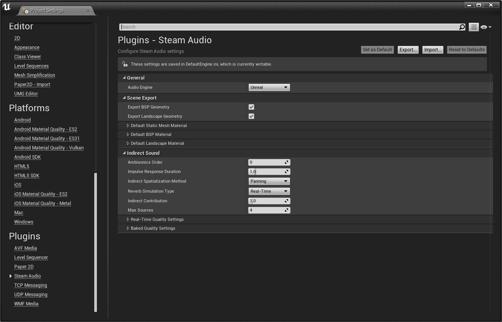

Setting the **Reverb Simulation Type** to **Disabled** tells Steam Audio not to apply listener-centric reverb.
Typically, you will either want to use listener-centric reverb, or per-source sound propagation on individual sources.
It is, however, possible to use both features if so desired.

#### Indirect Sound Settings
You can fine-tune various settings that control how Steam Audio simulates physics-based indirect sound. This can help
you achieve the right balance between simulation quality and in-game performance. To access the settings:

1. In the main menu, click **Edit** > **Project Settings**.
2. In the left pane, under **Plugins**, select **Steam Audio**.

You can now adjust various settings for indirect sound. These settings apply to listener-centric reverb as well as
per-source sound propagation (for all sources that use it).


##### Ambisonics Order
This determines the directionality of environmental effects. Increasing this increases the compute complexity
quadratically. Use zero order Ambisonics if no directionality is needed in environmental effects. Otherwise, first order
Ambisonics should provide a good tradeoff between directionality and CPU usage.

##### Impulse Response Duration
This is the length of the impulse responses to generate, in seconds. Increasing this improves the quality of the
simulation, but beyond a certain point (depending on the number of sound sources), may result in audio glitching.

##### Indirect Spatialization Method
If set to **Panning**, Steam Audio will apply a standard panning algorithm to render the Ambisonics-encoded
environmental effects. If set to **HRTF**, Steam Audio will decode the environmental effects using an HRTF-based
binaural rendering algorithm, for improved spatialization of indirect sound.

##### Indirect Contribution
Increasing this value increases the contribution of indirect sound relative to the overall mix for listener-centric
reverb.

##### Max Sources
This is the maximum number of sound sources that can have per-source sound propagation enabled. For the purposes of this
setting, listener-centric reverb counts as a source. For example, if Max Sources is set to 8, and you are using
listener-centric reverb, then you can have up to 7 sources that use per-source sound propagation.

##### Real-Time Quality Settings
These settings let you fine-tune how Steam Audio simulates physics-based indirect sound. You can select one of the
presets from the **Quality Preset** drop-down, or select **Custom**, and adjust the following settings.

###### Rays
This is the number of primary and reflection rays to trace from the listener position for real-time computation of
environmental effects. Increasing this improves the quality of the simulation, at the cost of performance.

###### Secondary Rays
This is the number of directions that are sampled when simulating diffuse reflection. Setting this number too low may
reduce the overall quality.

###### Bounces
Number of times the rays are allowed to bounce off of solid objects in real-time. Increasing this improves the quality
of the simulation, at the cost of performance.

##### Baked Quality Settings
These settings are analogous to Real-Time Quality Settings, but are only used when baking indirect sound effects in
the Unreal editor. See the next section for details.

### Baked Environmental Audio Effects
As an alternative to simulating physics-based environmental effects in real time, you can choose to _bake_ them in
the Unreal editor. At run-time, the baked environmental effect information is used to look up the appropriate filters
to apply based on the source and/or listener position. This way, you can perform much more detailed simulations as a
pre-process, trading off CPU usage at run-time for additional disk space and memory usage for the baked data.

#### Placing Probes
Before you can bake environmental audio effects, you must place _probes_ at all points in your scene where you want to
bake environmental effects. A probe is a point at which environmental audio effects are sampled.

##### Probe Volumes
To create probes, you must first create a _Probe Volume_, which is a box-shaped region of space in which multiple
probes will automatically be generated by Steam Audio. To create a Probe Volume:

1. In the **Modes** tab, click **Volumes**.
2. Drag a **Phonon Probe Volume** actor into your scene.
3. Using Unreal's built-in translation and scaling gizmos, adjust the position and size of the Probe Volume so that it
   covers the geometry on/in which you want to generate probes.


You can create multiple Probe Volumes throughout the scene, Steam Audio will bake environmental effects for all
probes in all Probe Volumes.

##### Probe Generation
Once a Probe Volume has been created, you must generate probes within it:

1. In the **World Outliner** tab, click the Probe Volume in which you wish to generate probes.
2. In the **Details** tab, select a **Placement Strategy** (see below).
3. Click **Generate Probes**.

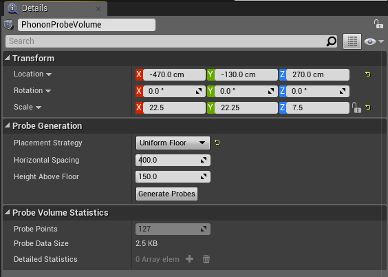

The probes will be displayed as blue dots in the scene.

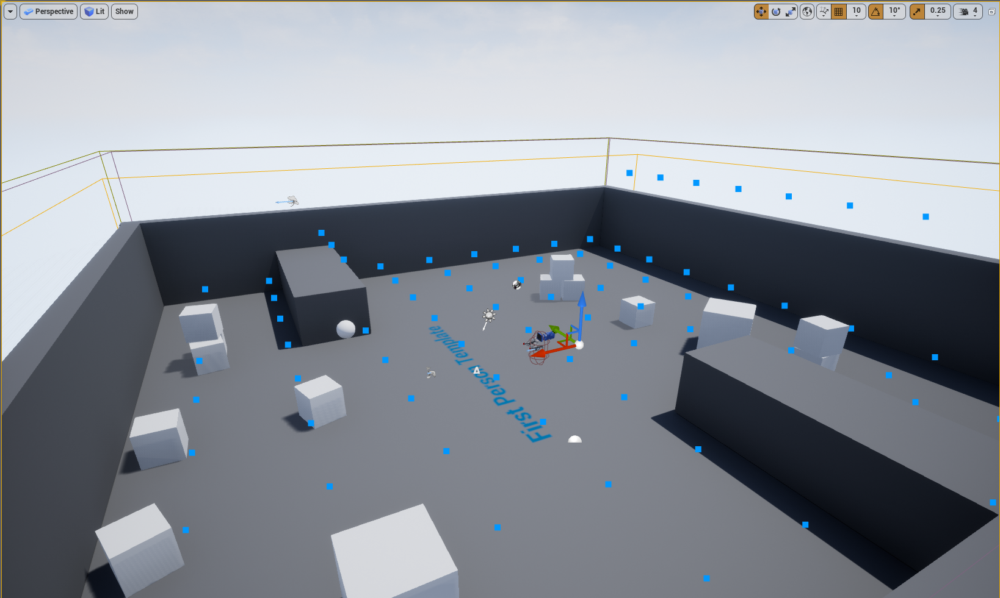

The Probe Placement Strategy determines how Steam Audio generates probes within a Probe Volume. Steam Audio currently
supports the following strategies:

###### Centroid
Places a single probe at the center of the Probe Volume.

###### Uniform Floor
Places probes at a certain height above the floor with a certain horizontal spacing between them. The height is specified by the **Height Above Floor** parameter. Spacing is specified by the **Horizontal Spacing** parameter.

#### Baked Per-Source Sound Propagation
This section describes how to configure Steam Audio to generate and use baked data for per-source sound propagation.

##### Generating Baked Sound Propagation
To pre-compute sound propagation effects for a specific source:

1. In the **World Outliner**, select the actor containing the Audio component for you want to bake sound propagation.
2. In the **Details** view, click **Add Component**.
3. In the Add Component menu, click **Phonon Source**.
4. Specify a **Unique Identifier** for this source. Each baked source must have a distinct Unique Identifier.
5. Adjust the **Baking Radius** as needed. This radius, measured in game units, defines a sphere such that sound
   propagation is baked at all probes that lie within the sphere.
6. Click **Bake Propagation**.

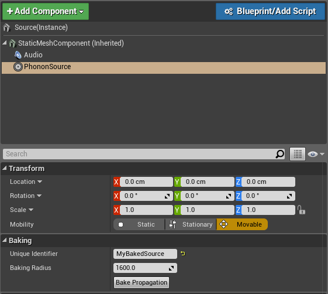

##### Using Baked Sound Propagation
To configure a sound source to use baked data, follow these steps:

1. In the **World Outliner** tab, select the actor containing the Audio component you want to configure.
2. In the **Details** tab, click the Audio component.
3. Under **Attenuation**, expand **Attenuation Overrides**.
4. In the **Reverb Plugin Settings** drop-down, click **Edit**.
5. In the window that appears, in the **Indirect Simulation Type** drop-down, select **Baked**.

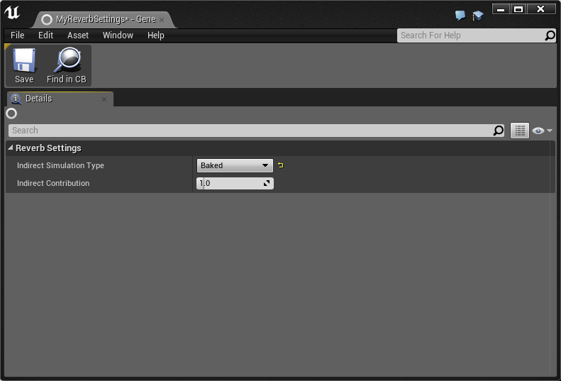

#### Baked Listener-Centric Reverb
This section describes how to configure Steam Audio to generate and use baked data for listener-centric reverb.

##### Generating Baked Reverb
To pre-compute listener-centric reverb effects:

1. In the toolbar, click the down arrow next to **Build**.
2. Click **Bake Indirect Sound...**.
3. Select **\_\_reverb\_\_** and click **Bake Selected**.


##### Using Baked Reverb
To configure Steam Audio to use baked data for listener-centric reverb:

1. In the main menu, click **Edit** > **Project Settings**.
2. In the left pane, under **Plugins**, select **Steam Audio**.
3. In the **Reverb Simulation Type** drop-down, select **Baked**.

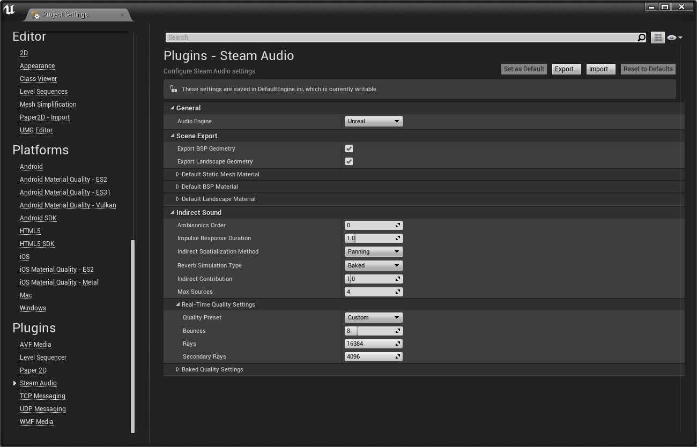

### AMD TrueAudio Next

Steam Audio provides optional support for AMD TrueAudio Next, which allows you to reserve a portion of the GPU for
accelerating convolution operations. TrueAudio Next requires a supported AMD Radeon GPU. 
If you choose to enable TrueAudio Next support in your UE4 project, then Steam Audio will try to use the GPU to 
accelerate the rendering of indirect sound, including real-time source-centric propagation, baked static listener propagation, real-time listener-centric reverb, and baked listener-centric reverb.

##### Enabling TrueAudio Next

To enable TrueAudio Next for Steam Audio:

1. In the main menu, click **Edit** > **Project Settings**.
2. In the left pane, under **Plugins**, select **Steam Audio**.
3. In the **Convolution Type** dropdown, select **AMD TrueAudio Next**.

When TrueAudio Next is enabled, you can also override some of the simulation settings
that are normally configured on the Steam Audio Manager Settings component. These include 
**Impulse Response Duration**, **Ambisonics Order**, and **Max Sources**.

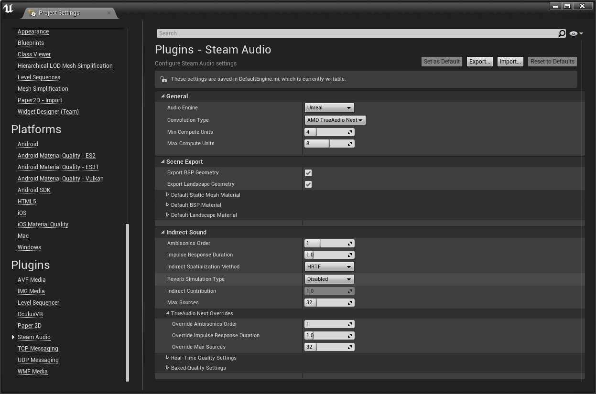

These overrides allow you to switch to a higher level of acoustic detail when the user's PC has a supported
GPU, while seamlessly falling back to using the CPU with the settings configured on the Steam Audio Manager
Settings component if a supported GPU is not found.

##### Resource Reservation

When TrueAudio Next is enabled, you can configure the following Resource 
Reservation settings, which allow you to control how much of the GPU is set 
aside for audio processing tasks:

- **Min Compute Units To Reserve**. This is the smallest number of GPU Compute Units (CUs) that should be possible
 to reserve for audio processing. If the user's GPU does not support this many reserved CUs, then TrueAudio Next
 initialization will fail and Steam Audio will fall back to CPU convolution. For example, if this value is set to 4,
 but the user's GPU only supports reserving up to 2 CUs, TrueAudio Next initialization will fail.
- **Max Compute Units To Reserve**. This is the largest number of CUs that Steam Audio will try to reserve for audio
 processing. Steam Audio will try to reserve as many CUs as it can, up to this limit. If the user's GPU does not
 support reserving any number of CUs between **Min Compute Units To Reserve** and **Max Compute Units To Reserve**,
 then TrueAudio Next initialization will fail and Steam Audio will fall back to CPU convolution. For example, if
 **Min Compute Units To Reserve** is set to 2 and **Max Compute Units To Reserve** is set to 4, but the user's GPU
 only supports reserving 8 or more CUs, TrueAudio Next initialization will fail.

### Packaging Your Game

Once you're ready to package your game, you need to make sure that you copy the
Steam Audio runtime data directory. To do so:

1. In the main menu, click **Edit** > **Project Settings**.
2. In the left pane, under **Project**, select **Packaging**.
3. In the **Packaging** section, expand the advanced section.
4. Add a new directory to the **Additional Non-Asset Directories to Copy** array.
5. Browse and select **SteamAudio/Runtime**.


#### Deploying on Android

Inside of your **Config** folder, you will need to create **Android/AndroidEngine.ini**. Inside, you should have:

```
[Audio]
AudioDeviceModuleName=AudioMixerAndroid
```

You may also need to play with the headroom parameter if you're experiencing clipping. In our experiments for 4.19,
-4db was a reasonable value.

```
[Audio]
AudioDeviceModuleName=AudioMixerAndroid
PlatformHeadroomDB=-4
```
